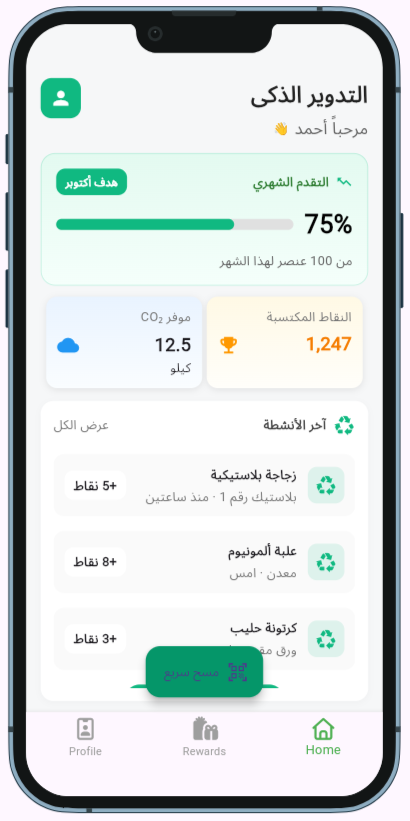
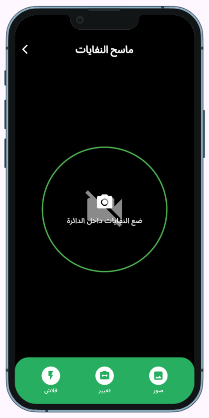
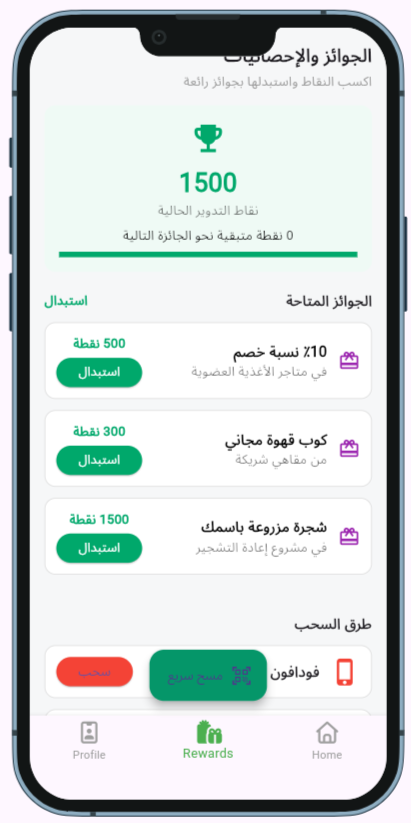
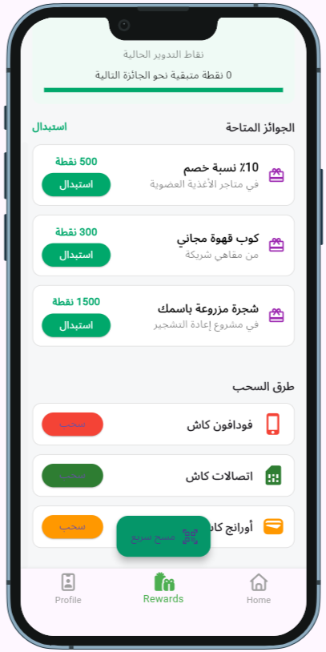
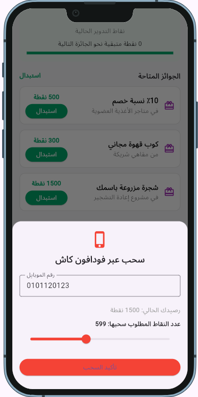
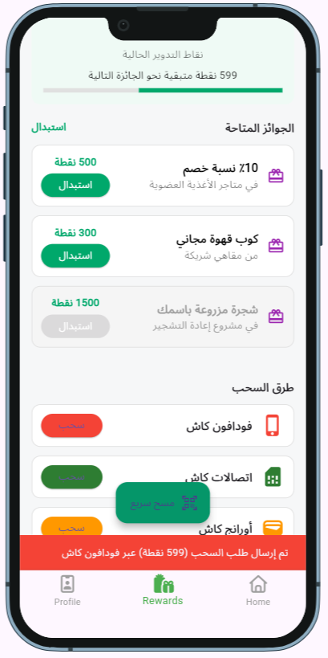
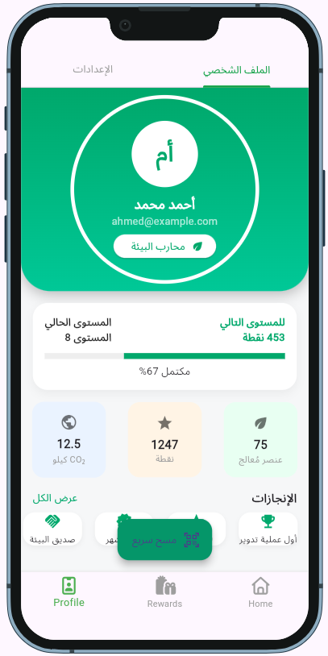
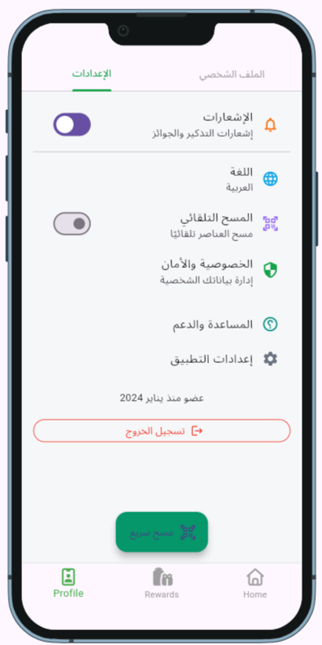

<h1 align="center">Hi 👋, I'm Ahmed H. Elgazar</h1>
<h3 align="center">I'm a passionate Software Developer specializing in Flutter and Android. I enjoy building clean, scalable mobile applications and constantly improving my skills. Currently focused on clean architecture, performance, and great user experiences.</h3>

- 🔭 I’m currently working on [Building mobile apps with Flutter](https://github.com/ahmedhamada202113227-maker/dasHboard)

- 🌱 I’m currently learning **Advanced Flutter • Clean Architecture • State Management**

- 👯 I’m looking to collaborate on **Flutter & Mobile App Projects**

- 👨‍💻 All of my projects are available at [https://github.com/ahmedhamada202113227-maker](https://github.com/ahmedhamada202113227-maker)

- 💬 Ask me about **Flutter, Android, Mobile App Development**

- 📫 How to reach me **ahmedhamada202113227@gmail.com**

- 📄 Know about my experiences [## 💻 Technical Experience - **Flutter & Android Development** Built multiple cross-platform mobile apps with Flutter, focusing on clean architecture and scalable code. - **Git & GitHub** Experienced in version control, branching strategies, pull requests, and collaborative workflows. - **Firebase & Backend Integration** Integrated apps with Firebase Auth, Firestore, and Cloud Functions. - **UI/UX Implementation** Designed intuitive and responsive user interfaces, following best practices for user experience. ## 🧠 Soft Skills - Problem Solving & Logical Thinking - Team Collaboration & Communication - Time Management & Productivity](## 💻 Technical Experience - **Flutter & Android Development** Built multiple cross-platform mobile apps with Flutter, focusing on clean architecture and scalable code. - **Git & GitHub** Experienced in version control, branching strategies, pull requests, and collaborative workflows. - **Firebase & Backend Integration** Integrated apps with Firebase Auth, Firestore, and Cloud Functions. - **UI/UX Implementation** Designed intuitive and responsive user interfaces, following best practices for user experience. ## 🧠 Soft Skills - Problem Solving & Logical Thinking - Team Collaboration & Communication - Time Management & Productivity)

<h3 align="left">Connect with me:</h3>
<p align="left">
<a href="https://linkedin.com/in/www.linkedin.com/in/ahmed-hamada-elgazar-003442304" target="blank"></a>
<a href="https://www.topcoder.com/members/12585" target="blank"></a>
</p>

<h3 align="left">Languages and Tools:</h3>
<p align="left"> <a href="https://developer.android.com" target="_blank" rel="noreferrer">  </a> <a href="https://dart.dev" target="_blank" rel="noreferrer">  </a> <a href="https://www.figma.com/" target="_blank" rel="noreferrer">  </a> <a href="https://flutter.dev" target="_blank" rel="noreferrer">  </a> </p>

# Smart Recycle Bin - Flutter App

## 📱 نظرة عامة
تطبيق موبايل متكامل لمساعدة المستخدمين على الإقلاع عن العادات السلبية من خلال:
<!-- - تتبع يومي للتقدم
- رسائل تحفيزية منتظمة
- تقويم شهري للأيام الناجحة
- تتبع الصلوات الخمس
- مذكرات شخصية
- نظام مكافآت محفز
- إعدادات قابلة للتخصيص -->

## 🏗️ البنية المعمارية
التطبيق مبني على نمط **MVVM** (Model-View-ViewModel):

```
lib/
├── models/           # Data structures
├── viewmodels/       # Business logic + State management
├── views/            # UI screens
├── services/         # Storage and utilities
└── utils/            # Constants and themes
```

## 📋 المتطلبات
- Flutter SDK 3.0.0 أو أحدث
- Dart 3.0.0 أو أحدث
- Android Studio / VS Code
- Android SDK (للأندرويد)
- Xcode (للآيفون - macOS فقط)

### 5. تشغيل التطبيق
```bash
# لتشغيل على المحاكي أو الجهاز المتصل
flutter run

# لتشغيل على جهاز معين
flutter run -d <device-id>

# لعرض الأجهزة المتاحة
flutter devices
```

## 📦 الحزم المستخدمة

| الحزمة |
|--------|
| dartz |
| barcode_widget |
| intl |
| pdf |
| printing |
| flutter_bloc |
| flutter_custom_clippers |
| flutter_svg |
| get_it |
| font_awesome_flutter |
| modal_progress_hud_nsn |
| shared_preferences |

## 📱 الشاشات

### 1. Home Screen
شاشة البداية مع شعار التطبيق

### 2. Rewards Screen

### 3. Profile Screen


## 🎨 التصميم

### الألوان الأساسية
```dart
Primary Blue: #3B82F6
Success Green: #10B981
Warning Orange: #F59E0B
Danger Red: #EF4444
Purple: #8B5CF6
Indigo: #6366F1
```

<!-- ## 💾 التخزين المحلي

يستخدم التطبيق **SharedPreferences** لحفظ:
- حالة Onboarding
- سلسلة النجاح (Streak Days)
- الرسائل المقروءة
- بيانات التقويم
- الصلوات المنجزة
- المذكرات
- المكافآت
- الإعدادات (المدينة، Dark Mode، إلخ) -->

## 📱 البناء للإنتاج

### Android
```bash
# بناء APK
flutter build apk --release

# بناء App Bundle (للنشر على Google Play)
flutter build appbundle --release
```

### iOS
```bash
# بناء IPA
flutter build ios --release
```

## 🔐 الأمان والخصوصية
- **جميع البيانات محلية:** لا يتم إرسال أي بيانات لخوادم خارجية
- **عدم جمع بيانات شخصية:** التطبيق لا يجمع معلومات المستخدم
- **الخصوصية التامة:** المذكرات والبيانات محفوظة على الجهاز فقط

## 📊 الميزات المستقبلية (اختياري)
- [ ] دعم النسخ الاحتياطي على السحابة
- [ ] إشعارات محلية للتذكير
- [ ] رسوم بيانية للتقدم
- [ ] دعم لغات إضافية

## 🤝 المساهمة
هذا المشروع جاهز للاستخدام والتطوير. يمكنك:
- إضافة ميزات جديدة
- تحسين التصميم
- إصلاح الأخطاء
- ترجمة التطبيق

## 📄 الترخيص
هذا المشروع مفتوح المصدر ومتاح للاستخدام الشخصي والتجاري.

## 📞 الدعم
للأسئلة أو المشاكل:
1. راجع هذا الدليل
2. راجع ملف `IMPLEMENTATION_GUIDE.md`
3. تحقق من التعليقات في الكود

## 🎉 مبروك!
التطبيق جاهز للاستخدام. رحلة موفقة! 💪

---

**تم التطوير بـ ❤️ لمساعدة الأشخاص في التسوق والحصول علي افضل العروض**

**لا تنسَ:** "النجاح ليس عدم الوقوع، بل القيام بعد كل مرة تقع فيها"


# Smart Recycle Bin App 

Here are some screenshots of my app:









